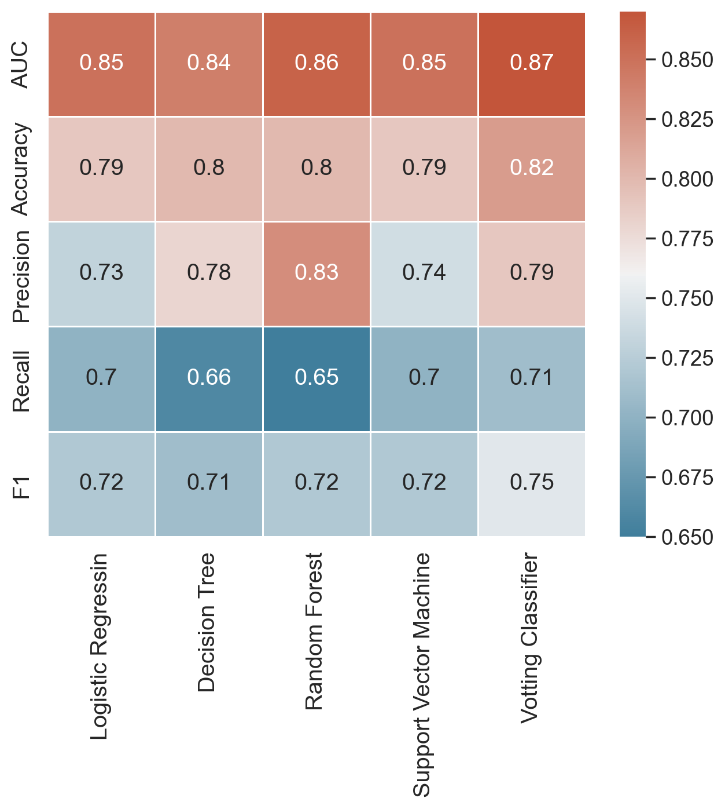

# Prediction of survival using classification models and deploy best model with REST API

- Used Titanic dataset from **Kaggle** to build and compare a variety of machine learning classifiers with sckit-learn (logistic regression, decision trees, support vector machine, random forest, voting classifier), in order to predict survival of passengers on the titanic
- Project comprised all phases of machine learning workflow (e.g., train-test-splitting the data, data exploration, feature engineering (incl. pipelines), optimization of hyperparameters, evaluation via cross-validation)

Figure : Main perfromance metrics for implemented machine learning classifiers
